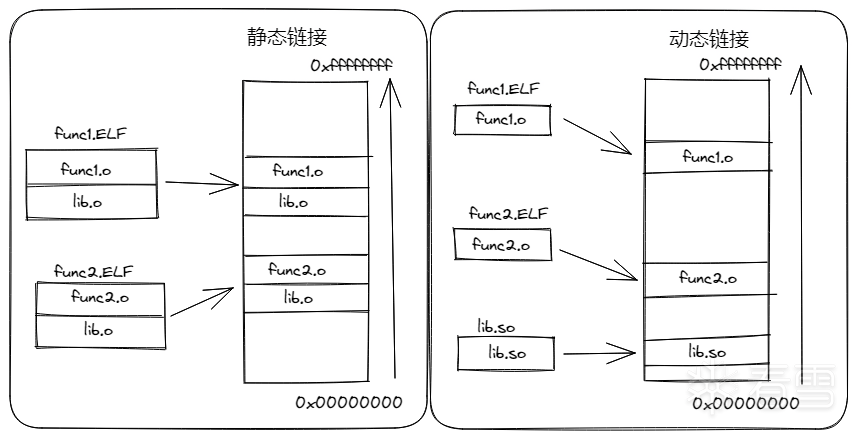

# PLT&GOT
## 静态链接&&动态链接
在程序加载时，通过`.rel` `section`，让编译器基于重定位信息计算出调用函数在程序中的实际位置的加载方式，一般被称为`静态链接`，如果程序使用了外部的库函数时，整个库函数都会被直接编译到程序中。

可以思考一下它的缺点，以及对应的改正方法：

+ 在一段只输出`hello world`的程序中，采用静态链接，需要将整个`glibc`链接到程序中，如果`500`个程序都需要使用`glibc`
  中的函数，那么`glibc`就会被封装进`500`个程序中。
+ 可不可以将多个程序都会使用的库单独剥离出来，同时在源程序和库之间建立某种联系，确保源程序在执行的时候可以调用到库函数？

`动态链接`技术的提出就是为了解决这个问题，在程序运行时，将共享库和程序本身进行链接，同时，内存里的程序可以共享同一个库文件，这样既节省了硬盘存储空间，同样节省了内存空间。

静态链接与动态链接主要区别如下图所示:



为了做到动态编译，首先需要生成位置无关代码（`Posistion-Independent Code`,`PIC`）,通过`PIC`一个共享库可以被多个进程共享。

同时想要完成动态链接在`源程序`中还需要有：

+ 一个用来存储外部函数地址的数据段
+ 一段用来加载外部函数的代码

因为数据段和代码段之间的距离是一个运行时常量，他们之间的偏移是固定的，于是这里就有了全局偏移表（`GOT`，`Global Offset Table`
），它位于`数据段`的`开始`，用于`保存全局变量`以及`库函数`（`外部函数`）的`引用`，每一条8个字节，在`程序加载时`
会`完成重定位`，并`填入符号`的`绝对地址`。`GOT`一般被拆成了`两`个`section`，`不需要延迟绑定`，用于`存储全局变量`
，加载到内存中只需要被读取的`.got`，以及为了存储库函数需要延迟绑定写入的`.got.plt`。

而同时为了完成延迟绑定还需要将外部函数的值在运行时写入`.got.plt`
，因此又引入了过程链接表（`PLT`,`Procedure Liknage Table`）。`PLT`是由`代码片段`组成，用于`将地址无关函数`转移到`绝对地址`
。每一个`被调用的库函数`，都会映射到一组`PLT`和`GOT`。如下图所示：


`.got.plt`用来保存函数引用的地址，即把外部函数的引用分离到`.got.plt`中。另外“.got.plt”的前三项是有特殊意义的：

+ 第一项保存的是`.dynamic`段的地址，这个段描述了本模块动态链接相关的信息
+ 第二项保存的是本模块的`ID`。
+ 第三项保存的是`_dl_runtime_resolve()`的地址。

## Lazying Binding

`Lazy Binding`，即`延迟绑定`，指的是只有当函数被调用的时候才进行函数绑定，这种方式加快的程序的启动速度。
为了完成延迟绑定的过程，`PLT`和`GOT`需要配合完成一些事情。

## 验证
### 环境
```bash
❯ aarch64-linux-gnu-cc -v
❯ x86_64-linux-gnu-cc -v
```
### 源代码
```C
#include <stdio.h>

int main() {
    int integer;
    printf("Enter an integer: ");
    scanf("%d", &integer);  
    printf("Number = %d\n", integer);
    return 0;
}
```
### 编译
#### 简单编译
```bash
x86_64-linux-gnu-gcc main.c -z norelro -fno-stack-protector -o test
```
简单起见，使用`gcc`选项`-z norelro`关闭了`RELRO`，`-fno-stack-protector`关闭了`CANNARY`。
##### checksec test
`Checksec`是一个`shell`脚本，可用于检查`Linux`中二进制文件的属性。这可用于检查多种缓解技术，例如`PIE`、`RELRO`、`NoExecute`、`Stack Canaries`、`ASLR`等。`Checksec`可以检查`Linux`内核，以查看某些安全功能是否已打开。将源代码编译为二进制文件时，可以在编译时启用或禁用一些安全功能，但是，默认情况下，在编译应用程序时，这些功能中的大多数都不会打开，必须在编译时进行设置。
+ `NX`：`-z execstack`/`-z noexecstack` (关闭 / 开启)
+ `Canary`：`-fno-stack-protector`/`-fstack-protector`/`-fstack-protector-all`(关闭 / 开启 / 全开启)
+ `PIE`：`-no-pie`/`-pie` (关闭 / 开启)
+ `RELRO`：`-z norelro` /`-z lazy`/`-z now` (关闭 / 部分开启 / 完全开启)
```bash
brew install pwntools

checksec test
[*] './test'
    Arch:     amd64-64-little
    RELRO:    No RELRO
    Stack:    No canary found
    NX:       NX enabled
    PIE:      No PIE (0x400000)
```
##### Run ELF 64-bit LSB executable on Mac？？？
https://github.com/karton/karton
#### 延迟绑定
```bash
x86_64-linux-gnu-gcc main.c -o test -save-temps -g -Wl,-z,lazy
```
+ -save-temps 会保存所有的中间输出结果。
+ -Wl,-z,lazy强制开启延迟绑定。
+ -g 方便调试。
### 汇编代码
.o文件
```bash
objdump -d test-main.o
```
可执行文件test
```bash
objdump -d test

objdump --disassemble --full-contents --section=.text test

0000000000401164 <main>:
  401164:       55                      push   %rbp
  401165:       48 89 e5                mov    %rsp,%rbp
  401168:       48 83 ec 10             sub    $0x10,%rsp
  40116c:       bf 04 20 40 00          mov    $0x402004,%edi
  401171:       b8 00 00 00 00          mov    $0x0,%eax
  401176:       e8 c5 fe ff ff          call   401040 <printf@plt>
  40117b:       48 8d 45 fc             lea    -0x4(%rbp),%rax
  40117f:       48 89 c6                mov    %rax,%rsi
  401182:       bf 17 20 40 00          mov    $0x402017,%edi
  401187:       b8 00 00 00 00          mov    $0x0,%eax
  40118c:       e8 cf fe ff ff          call   401060 <__isoc99_scanf@plt>
  401191:       8b 45 fc                mov    -0x4(%rbp),%eax
  401194:       89 c6                   mov    %eax,%esi
  401196:       bf 1a 20 40 00          mov    $0x40201a,%edi
  40119b:       b8 00 00 00 00          mov    $0x0,%eax
  4011a0:       e8 9b fe ff ff          call   401040 <printf@plt>
  4011a5:       b8 00 00 00 00          mov    $0x0,%eax
  4011aa:       c9                      leave
  4011ab:       c3                      ret
  4011ac:       0f 1f 40 00             nopl   0x0(%rax)
```
### .plt|.got
```bash
readelf -S test | egrep  '.plt|.got'
  [11] .rela.plt         RELA             00000000004004c0  000004c0
  [13] .plt              PROGBITS         0000000000401030  00001030
  [14] .plt.got          PROGBITS         0000000000401070  00001070
  [23] .got              PROGBITS         0000000000403330  00002330
  [24] .got.plt          PROGBITS         0000000000403338  00002338
```
### .plt
PLT 中的每一项都是一小段代码，所以使用 objdump 命令查看 .plt 段的内容时添加反汇编参数。选项 --disassemble（可简写为 -d）的含义是 Display assembler contents of executable sections，--full-contents（可简写为 -s）的含义是 Display the full contents of all sections requested，--section（可简写为 -j）的含义是 Display information only for section name。
```bash
objdump --disassemble --full-contents --section=.plt test


test:     file format elf64-x86-64

Contents of section .plt:
 401030 ff350a23 0000ff25 0c230000 0f1f4000  .5.#...%.#....@.
 401040 ff250a23 00006800 000000e9 e0ffffff  .%.#..h.........
 401050 ff250223 00006801 000000e9 d0ffffff  .%.#..h.........
 401060 ff25fa22 00006802 000000e9 c0ffffff  .%."..h.........

Disassembly of section .plt:

0000000000401030 <printf@plt-0x10>:
  401030:       ff 35 0a 23 00 00       push   0x230a(%rip)        # 403340 <_GLOBAL_OFFSET_TABLE_+0x8>
  401036:       ff 25 0c 23 00 00       jmp    *0x230c(%rip)        # 403348 <_GLOBAL_OFFSET_TABLE_+0x10>
  40103c:       0f 1f 40 00             nopl   0x0(%rax)

0000000000401040 <printf@plt>:
  401040:       ff 25 0a 23 00 00       jmp    *0x230a(%rip)        # 403350 <printf@GLIBC_2.2.5>
  401046:       68 00 00 00 00          push   $0x0
  40104b:       e9 e0 ff ff ff          jmp    401030 <_init+0x30>

0000000000401050 <__libc_start_main@plt>:
  401050:       ff 25 02 23 00 00       jmp    *0x2302(%rip)        # 403358 <__libc_start_main@GLIBC_2.2.5>
  401056:       68 01 00 00 00          push   $0x1
  40105b:       e9 d0 ff ff ff          jmp    401030 <_init+0x30>

0000000000401060 <__isoc99_scanf@plt>:
  401060:       ff 25 fa 22 00 00       jmp    *0x22fa(%rip)        # 403360 <__isoc99_scanf@GLIBC_2.7>
  401066:       68 02 00 00 00          push   $0x2
  40106b:       e9 c0 ff ff ff          jmp    401030 <_init+0x30>
```
### .got.plt
GOT 的每一项都是一个地址，因此不用进行反汇编。同样使用 objdump 命令查看。
这是我们常说的GOT, 即Global Offset Table, 全局偏移表. 这是链接器在执行链接时
实际上要填充的部分, 保存了所有外部符号的地址信息.
不过值得注意的是, 除了每个函数占用一个GOT表项外，GOT表项还保留了
3个公共表项, 每项32位(4个字节), 保存在前三个位置, 分别是:
```bash
objdump --full-contents --section=.got.plt test

test:     file format elf64-x86-64

Contents of section .got.plt:
 403338 90314000 00000000 00000000 00000000  .1@.............
 403348 00000000 00000000 46104000 00000000  ........F.@.....
 403358 56104000 00000000 66104000 00000000  V.@.....f.@.....
```
+ 第0项.dynamic 段地址

+ got[0]: 本ELF动态段(.dynamic段)的装载地址

+ 第1项.本镜像的link_map数据结构地址，未运行无法确定，故以全 0 填充

+ got[1](http://www.cs.stevens.edu/~jschauma/810/elf.html): 本ELF的`link_map`数据结构描述符地址
  ```
  struct link_map
  {
     /* Shared library's load address. */
     ElfW(Addr) l_addr;                 
     /* Pointer to library's name in the string table. */                                 
     char *l_name;    
     /* 
          Dynamic section of the shared object.
          Includes dynamic linking info etc.
          Not interesting to us.  
     */                   
     ElfW(Dyn) *l_ld;   
     /* Pointer to previous and next link_map node. */                 
     struct link_map *l_next, *l_prev;   
  };
  ```
+ 第2项._dl_runtime_resolve 函数地址，未运行无法确定，故以全 0 填充

+ got[2](http://www.cs.dartmouth.edu/~sergey/cs108/dyn-linking-with-gdb.txt): `_dl_runtime_resolve`函数的地址

+ 第n项.函数对应的GOT表项
### .rela
```bash
readelf --relocs test

Relocation section '.rela.dyn' at offset 0x4a8 contains 1 entry:
  Offset          Info           Type           Sym. Value    Sym. Name + Addend
000000403330  000300000006 R_X86_64_GLOB_DAT 0000000000000000 __gmon_start__ + 0

Relocation section '.rela.plt' at offset 0x4c0 contains 3 entries:
  Offset          Info           Type           Sym. Value    Sym. Name + Addend
000000403350  000100000007 R_X86_64_JUMP_SLO 0000000000000000 printf@GLIBC_2.2.5 + 0
000000403358  000200000007 R_X86_64_JUMP_SLO 0000000000000000 __libc_start_main@GLIBC_2.2.5 + 0
000000403360  000400000007 R_X86_64_JUMP_SLO 0000000000000000 __isoc99_scanf@GLIBC_2.7 + 0
readelf -S test | grep 000000403330 -B 2
[22] .dynamic          DYNAMIC          0000000000403190  00002190
       00000000000001a0  0000000000000010  WA       7     0     8
[23] .got              PROGBITS         0000000000403330  00002330

```
### 对比分析
以 printf 函数为例，分析 PLT 和 GOT 的工作过程。
+ .text
```bash
objdump --disassemble --full-contents --section=.text test

401176:       e8 c5 fe ff ff          call   401040 <printf@plt>
```
+ 比较 看到 main 函数调用printf函数的指令是 callq 0x401040，0x401040正是printf函数的PLT表项的地址。反汇编结果里的403350 <printf@GLIBC_2.2.5>也明确地指出了这一点。
+ .plt
```bash
objdump --disassemble --full-contents --section=.plt test

0000000000401040 <printf@plt>:
  401040:       ff 25 0a 23 00 00       jmp    *0x230a(%rip)        # 403350 <printf@GLIBC_2.2.5>
  401046:       68 00 00 00 00          push   $0x0
  40104b:       e9 e0 ff ff ff          jmp    401030 <_init+0x30>
```
它跳转到了 0x230a(%rip) 指向的地址，0x230a(%rip) 的内容在反汇编结果的注释中给出了，是 0x403350。0x403350正是printf函数的GOT表项的地址，其内容是 ？？？
+ .rela.plt
```bash
readelf --relocs test

Relocation section '.rela.dyn' at offset 0x4a8 contains 1 entry:
  Offset          Info           Type           Sym. Value    Sym. Name + Addend
000000403330  000300000006 R_X86_64_GLOB_DAT 0000000000000000 __gmon_start__ + 0

Relocation section '.rela.plt' at offset 0x4c0 contains 3 entries:
  Offset          Info           Type           Sym. Value    Sym. Name + Addend
000000403350  000100000007 R_X86_64_JUMP_SLO 0000000000000000 printf@GLIBC_2.2.5 + 0
000000403358  000200000007 R_X86_64_JUMP_SLO 0000000000000000 __libc_start_main@GLIBC_2.2.5 + 0
000000403360  000400000007 R_X86_64_JUMP_SLO 0000000000000000 __isoc99_scanf@GLIBC_2.7 + 0
```
+ .got.plt
```bash
objdump --full-contents --section=.got.plt test

test:     file format elf64-x86-64

Contents of section .got.plt:
 403338 90314000 00000000 00000000 00000000  .1@.............
 403348 00000000 00000000 46104000 00000000  ........F.@.....
 403358 56104000 00000000 66104000 00000000  V.@.....f.@.....
```
0	0x403338	0x0000000000403190	.dynamic 段地址
1	0x403340	0x0000000000000000	本镜像的link_map数据结构地址，未运行无法确定，故以全 0 填充
2	0x403348	0x0000000000000000	_dl_runtime_resolve 函数地址，未运行无法确定，故以全 0 填充
3	0x403350	0x0000000000401046	printf对应的GOT表项，内容是printf的PLT表项地址加6
可见 0x401040 处的jmp指令实际上跳到了0x401046处，相当于没有跳转。0x401046处的push指令将0x00压栈，可以理解为接下来要调用的函数的参数。接着40104b处的jmp指令跳转到了0x401030即PLT表的第0项。
```bash
0000000000401030 <printf@plt-0x10>:
  401030:       ff 35 0a 23 00 00       push   0x230a(%rip)        # 403340 <_GLOBAL_OFFSET_TABLE_+0x8>
  401036:       ff 25 0c 23 00 00       jmp    *0x230c(%rip)        # 403348 <_GLOBAL_OFFSET_TABLE_+0x10>
  40103c:       0f 1f 40 00             nopl   0x0(%rax)
```
先是把0x403340即GOT表的第1项压栈，接着跳转到0x403348即GOT表的第2项亦即_dl_runtime_resolve函数，解析printf函数真正的地址。之后会执行printf，并将 printf函数真正的地址写到printf对应的GOT表项中。这样下次调用printf函数时0x401040处的jmp指令会直接跳转到printf函数真正的地址，不用再调用 _dl_runtime_resolve。
## 参考
![ELF 文件 PLT 和 GOT 静态分析]https://blog.werner.wiki/elf-plt-got-static-analysis/
![有价值炮灰]https://www.cnblogs.com/pannengzhi/p/2018-04-09-about-got-plt.html