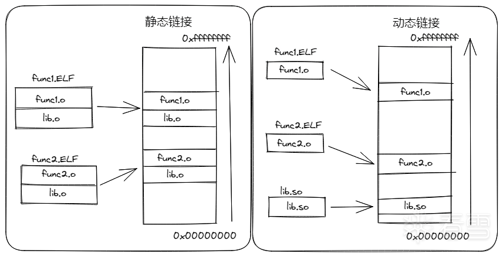
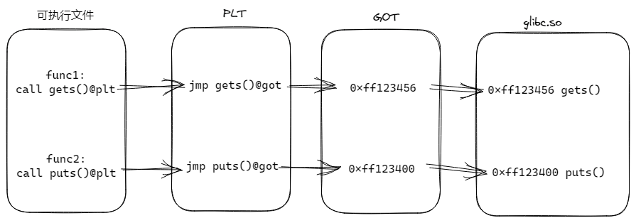

# PLT&GOT

在程序加载时，通过`.rel` `section`，让编译器基于重定位信息计算出调用函数在程序中的实际位置的加载方式，一般被称为静态链接，如果程序使用了外部的库函数时，整个库函数都会被直接编译到程序中。

可以思考一下它的缺点，以及对应的改正方法：

+ 在一段只输出`hello world`的程序中，采用静态链接，需要将整个`glibc`链接到程序中，如果`500`个程序都需要使用`glibc`
  中的函数，那么`glibc`就会被封装进`500`个程序中。
+ 可不可以将多个程序都会使用的库单独剥离出来，同时在源程序和库之间建立某种联系，确保源程序在执行的时候可以调用到库函数？

动态链接技术的提出就是为了解决这个问题，在程序运行时，将共享库和程序本身进行链接，同时，内存里的程序可以共享同一个库文件，这样既节省了硬盘存储空间，同样节省了内存空间。

静态链接与动态链接主要区别如下图所示:



为了做到动态编译，首先需要生成位置无关代码（`Posistion-Independent Code`,`PIC`）,通过`PIC`一个共享库可以被多个进程共享。

同时想要完成动态链接在`源程序`中还需要有：

+ 一个用来存储外部函数地址的数据段
+ 一段用来加载外部函数的代码

因为数据段和代码段之间的距离是一个运行时常量，他们之间的偏移是固定的，于是这里就有了全局偏移表（`GOT`，`Global Offset Table`
），它位于`数据段`的`开始`，用于`保存全局变量`以及`库函数`（`外部函数`）的`引用`，每一条8个字节，在`程序``加载时`
会`完成``重定位`，并`填入``符号`的`绝对地址`。`GOT`一般被拆成了`两`个`section`，`不需要延迟绑定`，用于`存储全局变量`
，加载到内存中只需要被读取的`.got`，以及为了存储库函数需要延迟绑定写入的`.got.plt`。

而同时为了完成延迟绑定还需要将外部函数的值在运行时写入`.got.plt`
，因此又引入了过程链接表（`PLT`,`Procedure Liknage Table`）。`PLT`是由`代码片段`组成，用于`将地址无关函数`转移到`绝对地址`
。每一个`被调用的库函数`，都会映射到一组`PLT`和`GOT`。如下图所示：



`.got.plt`用来保存函数引用的地址，即把外部函数的引用分离到`.got.plt`中。另外“.got.plt”的前三项是有特殊意义的：

+ 第一项保存的是`.dynamic`段的地址，这个段描述了本模块动态链接相关的信息
+ 第二项保存的是本模块的`ID`。
+ 第三项保存的是`_dl_runtime_resolve()`的地址。

## Lazying Binding

`Lazy Binding`，即`延迟绑定`，指的是只有当函数被调用的时候才进行函数绑定，这种方式加快的程序的启动速度。
为了完成延迟绑定的过程，`PLT`和`GOT`需要配合完成一些事情。

## 验证
### 环境
```bash
❯ aarch64-linux-gnu-cc -v
Using built-in specs.
COLLECT_GCC=aarch64-linux-gnu-cc
COLLECT_LTO_WRAPPER=/opt/homebrew/Cellar/aarch64-unknown-linux-gnu/11.2.0_1/toolchain/bin/../libexec/gcc/aarch64-unknown-linux-gnu/11.2.0/lto-wrapper
Target: aarch64-unknown-linux-gnu
Configured with: /Volumes/build/.build/aarch64-unknown-linux-gnu/src/gcc/configure --build=aarch64-build_apple-darwin21.6.0 --host=aarch64-build_apple-darwin21.6.0 --target=aarch64-unknown-linux-gnu --prefix=/Volumes/tools/aarch64-unknown-linux-gnu --exec_prefix=/Volumes/tools/aarch64-unknown-linux-gnu --with-sysroot=/Volumes/tools/aarch64-unknown-linux-gnu/aarch64-unknown-linux-gnu/sysroot --enable-languages=c,c++,fortran --enable-__cxa_atexit --disable-libmudflap --enable-libgomp --enable-libssp --enable-libquadmath --enable-libquadmath-support --enable-libsanitizer --disable-libmpx --disable-libstdcxx-verbose --with-gmp=/Volumes/build/.build/aarch64-unknown-linux-gnu/buildtools --with-mpfr=/Volumes/build/.build/aarch64-unknown-linux-gnu/buildtools --with-mpc=/Volumes/build/.build/aarch64-unknown-linux-gnu/buildtools --with-isl=/Volumes/build/.build/aarch64-unknown-linux-gnu/buildtools --enable-lto --enable-threads=posix --enable-target-optspace --with-linker-hash-style=both --enable-plugin --enable-gold --disable-nls --disable-multilib --with-local-prefix=/Volumes/tools/aarch64-unknown-linux-gnu/aarch64-unknown-linux-gnu/sysroot --enable-long-long
Thread model: posix
Supported LTO compression algorithms: zlib
gcc version 11.2.0 (GCC)
❯ x86_64-linux-gnu-cc -v
Using built-in specs.
COLLECT_GCC=x86_64-linux-gnu-cc
COLLECT_LTO_WRAPPER=/opt/homebrew/Cellar/x86_64-unknown-linux-gnu/11.2.0_1/toolchain/bin/../libexec/gcc/x86_64-unknown-linux-gnu/11.2.0/lto-wrapper
Target: x86_64-unknown-linux-gnu
Configured with: /Volumes/build/.build/x86_64-unknown-linux-gnu/src/gcc/configure --build=aarch64-build_apple-darwin21.6.0 --host=aarch64-build_apple-darwin21.6.0 --target=x86_64-unknown-linux-gnu --prefix=/Volumes/tools/x86_64-unknown-linux-gnu --exec_prefix=/Volumes/tools/x86_64-unknown-linux-gnu --with-sysroot=/Volumes/tools/x86_64-unknown-linux-gnu/x86_64-unknown-linux-gnu/sysroot --enable-languages=c,c++,fortran --enable-__cxa_atexit --disable-libmudflap --enable-libgomp --enable-libssp --enable-libquadmath --enable-libquadmath-support --enable-libsanitizer --enable-libmpx --disable-libstdcxx-verbose --with-gmp=/Volumes/build/.build/x86_64-unknown-linux-gnu/buildtools --with-mpfr=/Volumes/build/.build/x86_64-unknown-linux-gnu/buildtools --with-mpc=/Volumes/build/.build/x86_64-unknown-linux-gnu/buildtools --with-isl=/Volumes/build/.build/x86_64-unknown-linux-gnu/buildtools --enable-lto --enable-threads=posix --enable-target-optspace --with-linker-hash-style=both --enable-plugin --enable-gold --disable-nls --disable-multilib --with-local-prefix=/Volumes/tools/x86_64-unknown-linux-gnu/x86_64-unknown-linux-gnu/sysroot --enable-long-long
Thread model: posix
Supported LTO compression algorithms: zlib
gcc version 11.2.0 (GCC)
```
### 源代码
```C
#include <stdio.h>
v print_hello() {
  printf("hello PLT and GOT\n");
}

int main() {
  print_hello();
  return 0;
}
```
### 编译
```bash
x86_64-linux-gnu-gcc  main.c -o test -save-temps -g -Wl,-z,lazy
```
+ -save-temps 会保存所有的中间输出结果。
+ -Wl,-z,lazy强制开启延迟绑定。
+ -g 方便调试。
### 汇编代码
对比print_hello && main函数
.o文件
```bash
objdump -d test-main.o
```
可执行文件test
```bash
objdump -d test
```
### Relocate
对比目标代码和最终代码的反汇编代码，可以看到，在print_hello函数中，调用call函数时对应内容是有经过重定向
## 全局偏移表（Global Offset Table，GOT）

全局偏移表（Global Offset Table，GOT）是用于支持位置无关代码（Position Independent Code，PIC）的一种数据结构。GOT 主要用于动态链接库（如
.so 文件）和共享库中，以解决全局变量和函数地址的引用问题。

在动态链接库中，全局变量和函数的实际地址在编译时是未知的，因为库可以在程序运行时被加载到任意内存地址。为了解决这个问题，编译器和链接器会使用相对地址（而不是绝对地址）来引用全局变量和函数。这些相对地址是相对于库在内存中的基地址（Base
Address）的偏移量。

全局偏移表（GOT）就是用于存储这些相对地址的数据结构。每个动态链接库和共享库都有一个 GOT。在程序运行时，动态链接器（如
ld.so）会根据库的实际加载地址计算全局变量和函数的绝对地址，并将这些地址填充到 GOT 中。然后，库中的代码可以通过访问 GOT
来间接引用全局变量和函数。

GOT 的主要优点是它允许动态链接库和共享库在不同程序中共享相同的代码段（Text
Segment）。这是因为库中的代码可以在不同的内存地址运行，而不需要对代码进行重定位。这样可以节省内存并减少程序启动时间。

总结一下，全局偏移表（GOT）是一种用于支持位置无关代码（PIC）的数据结构，它存储了动态链接库和共享库中全局变量和函数的相对地址。在程序运行时，动态链接器会根据库的实际加载地址填充
GOT，以便库中的代码可以间接引用全局变量和函数。

### GOT如何做到指令的地址无关性？

GOT（全局偏移表）通过间接寻址实现了指令的地址无关性。以下是GOT如何做到地址无关性的详细解释：

+ 编译和链接：在编译和链接阶段，编译器和链接器会为位置无关代码（PIC）生成特殊的指令序列来访问全局变量和函数。这些指令序列使用相对于库基地址（Base
  Address）的偏移量（而不是绝对地址）来引用全局变量和函数。这些偏移量在GOT（全局偏移表）中存储。

+ 间接寻址：GOT中的条目包含全局变量和函数的地址。程序中的代码不直接引用这些地址，而是通过GOT进行间接寻址。这意味着，只要GOT中的地址得到正确填充，程序中的代码就可以在任意内存地址运行，而不需要进行重定位。

+ 动态链接器：在程序运行时，动态链接器（如ld.so）负责将库加载到内存并计算库的实际基地址。然后，动态链接器根据库的基地址和GOT中的偏移量计算全局变量和函数的实际地址，并将这些地址填充到GOT中。

+ 运行时访问：当程序运行时，代码通过访问GOT中的地址来间接引用全局变量和函数。由于GOT已经根据库的实际加载地址进行了填充，所以代码可以在不同的内存地址运行，而不受影响。

通过这种方式，GOT实现了指令的地址无关性。它允许动态链接库和共享库在不同程序中共享相同的代码段（Text
Segment），从而节省内存并减少程序启动时间。

### GOT和PLT之前的区别

GOT（全局偏移表，Global Offset Table）和 PLT（过程链接表，Procedure Linkage Table）都是用于支持位置无关代码（Position
Independent Code，PIC）的数据结构，它们在动态链接库和共享库中起到重要作用。尽管它们有一定的关联，但它们的主要目的和用途有所不同。

GOT（全局偏移表）：

GOT 是一种用于存储全局变量和函数地址的数据结构。它允许动态链接库和共享库在运行时解析全局变量和函数的实际地址，而无需对代码进行重定位。GOT
的主要作用是实现全局变量和函数的地址无关性，使得库中的代码可以在不同的内存地址运行。

PLT（过程链接表）：

ELF使用PLT（Procedure Linkage
Table）来实现延迟绑定，它使用了一些很精巧的指令序列来完成。在Glibc中，动态链接器完成绑定工作的函数叫_dl_runtime_resolve()
，它必须知道绑定发生在哪个模块中的哪个函数，因此假设其函数原型为_dl_runtime_resolve(module, function)。
当调用某个外部模块的函数时，并不直接通过GOT跳转，而是通过一个叫作PLT项的结构来进行跳转，每个外部函数在PLT中都有一个相应的项，比如bar()
函数在PLT中的项的地址称为bar@plt。
PLT 是一种用于实现懒加载（Lazy Binding）的数据结构。懒加载是一种运行时链接技术，它允许程序在调用外部函数时才解析这些函数的实际地址。PLT
包含了一系列跳转指令，这些指令会在第一次调用外部函数时触发动态链接器（如 ld.so）来解析函数的实际地址，并将地址填充到 GOT
中。在后续的函数调用中，程序会直接跳转到 GOT 中的地址，无需再次进行地址解析。

总结一下，GOT 和 PLT 都是用于支持位置无关代码的数据结构，但它们的主要目的和用途有所不同。GOT 用于存储全局变量和函数的地址，实现地址无关性；而
PLT 用于实现懒加载，允许程序在调用外部函数时才解析这些函数的实际地址。在动态链接库和共享库中，这两个数据结构通常会一起使用，以实现高效的运行时链接和地址解析。