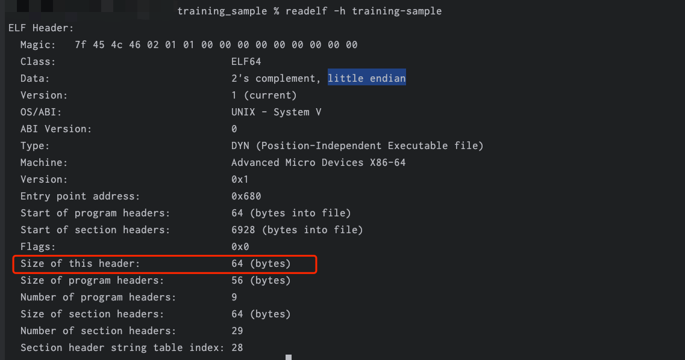
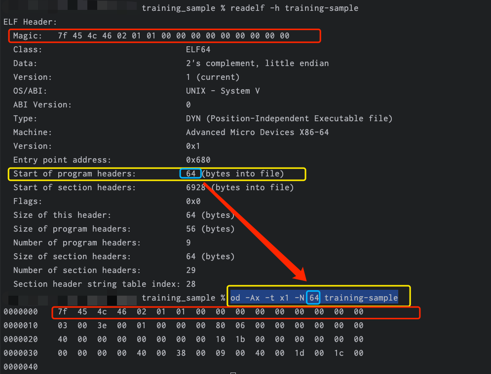

# EHDR




## 二进制解析

```Bash
od -Ad -t x1 -N 64 training-sample
0000000    7f  45  4c  46  02  01  01  00  00  00  00  00  00  00  00  00
0000016    03  00  3e  00  01  00  00  00  80  06  00  00  00  00  00  00
0000032    40  00  00  00  00  00  00  00  10  1b  00  00  00  00  00  00
0000048    00  00  00  00  40  00  38  00  09  00  40  00  1d  00  1c  00
0000064

xxd -u -a -g 1 -s 0 -l 64 training-sample
00000000: 7F 45 4C 46 02 01 01 00 00 00 00 00 00 00 00 00  .ELF............
00000010: 03 00 3E 00 01 00 00 00 80 06 00 00 00 00 00 00  ..>.............
00000020: 40 00 00 00 00 00 00 00 10 1B 00 00 00 00 00 00  @...............
00000030: 00 00 00 00 40 00 38 00 09 00 40 00 1D 00 1C 00  ....@.8...@.....
```

### 第一行

7f  45  4c  46  02  01  01  00  00  00  00  00  00  00  00  00

|               Value                |             Type             |    TAG     |
|:----------------------------------:|:----------------------------:|:----------:|
|                 7f                 |             文件标识             | 文件标识(0x7f) |
|             45  4c  46             |           ELF3个字符            | 文件标识(ELF)  |
|                 02                 | 文件类型  0 非法 1 32位目标   2 64位目标 |    64位     |
|                 01                 |  编码类型  0 非法 1 小端格式   2 大端格式  |     小端     |
|                 01                 |             文件版本             |  ELF头部版本   |
| 00  00  00  00  00  00  00  00  00 |           填充字段无意义            | 补齐字节，一般为0  |

### 第二行

03  00  3e  00  01  00  00  00  80  06  00  00  00  00  00  00

|             Value              |                                                                           Type                                                                            |  TAG   |
|:------------------------------:|:---------------------------------------------------------------------------------------------------------------------------------------------------------:|:------:|
|             03  00             |                                  文件类型e_type 0 NONE (未知目标文件格式) 1 REL (可重定位文件) 2 EXEC (可执行文件) 3 DYN (共享目标文件)4 CORE (转储格式)                                   |  DYN   |
|             3e  00             | 关于体系架构e_machine取值 0 No machine 2 SPARC 3 Intel 80386 8 MIPS I Architecture 0x14 PowerPC 0x28 Advanced RISC Machines ARM0x3e Advanced Micro Devices X86-64 | X86-64 |
|         01  00  00  00         |                                                                    文件格式的版本 1非法文件 2当前文件                                                                    |   2    |
| 80  06  00  00  00  00  00  00 |                                                                     e_entry 程序入口的虚拟地址                                                                     |        |

### 第三行

40  00  00  00  00  00  00  00  10  1b  00  00  00  00  00  00

|             Value              |       Type        | TAG |
|:------------------------------:|:-----------------:|:---:|
| 40  00  00  00  00  00  00  00 | e_phoff 程序段头表在该文件内的偏移，单位是字节 |     |
| 10  1b  00  00  00  00  00  00 | e_shoff 节头表在该文件内的偏移，单位是字节 |     |

### 第四行

00  00  00  00  40  00  38  00  09  00  40  00  1d  00  1c  00

|             Value              |       Type        | TAG |
|:------------------------------:|:-----------------:|:---:|
| 00  00  00  00   | e_flags 包含处理器特定的标记 |     |
| 40  00 | e_ehsize ELF头的大小，单位是字节 |     |
| 38  00 | e_phentsize 程序段头表项的大小，单位是字节 |     |
| 09  00 | e_phnum 程序段头表项的数量 |     |
| 40  00 | e_shentsize 节头表项的大小，单位是字节 |     |
| 1d  00 | e_shnum 节头表项的数量 |     |
| 1c  00 | e_shstrndx 节头表中包含节名字的字符串表索引 |     |

## 字符串表表项

### 获取字符串表表项地址

0x1C 0x00 这个表项，也就是第 28 个表项。

```Bash
 readelf -S training-sample        
There are 29 section headers, starting at offset 0x1b10:

Section Headers:
  [Nr] Name              Type             Address           Offset
       Size              EntSize          Flags  Link  Info  Align
  [ 0]                   NULL             0000000000000000  00000000
       0000000000000000  0000000000000000           0     0     0
  [28] .shstrtab         STRTAB           0000000000000000  00001a0f
       00000000000000fe  0000000000000000           0     0     1
Key to Flags:
  W (write), A (alloc), X (execute), M (merge), S (strings), I (info),
  L (link order), O (extra OS processing required), G (group), T (TLS),
  C (compressed), x (unknown), o (OS specific), E (exclude),
  D (mbind), l (large), p (processor specific)
```

其中的第 28 个 Section，描述的正是字符串表 Section:

```bash
.shstrtab         STRTAB           0000000000000000  00001a0f
00000000000000fe  0000000000000000           0     0     1
```

这个 Section 在 ELF 文件中的偏移地址是`0x00001a0f` 6671

### 计算e_shoff偏移

ELF 文件中的开始地址(e_shoff)10  1b  00  00  00  00  00  00
https://jisuan5.com/hexadecimal-to-decimal/
0x0000000000001b10             6928

### 计算节头表项的大小

e_shentsize 节头表项的大小40  00
https://jisuan5.com/hexadecimal-to-decimal/
0x0040   64

### 第 28 个表项的开始地址

注意这里的计算都是从 0 开始的，因此第 28 个表项的开始地址就是：6928 + （28 * 64） = 6928 + 1792 = 8720，也就是说用来描述字符串表这个 Section 的表项，位于 ELF 文件的 8720 字节的位置。

### 获取字符串表项section

|  成员   | 大小（32位） | 大小（64位） |
|:-----:|:-------:|:-------:|
| Word  |    4    |    4    |
| Xword |    4    |    8    |
| Addr  |    4    |    8    |
|  Off  |    4    |    8    |

Elf64_Word  4 个字节
Elf64_Xword 8个字节
Elf64_Addr 8个字节
Elf64_Off 8个字节

```C
typedef struct {
Elf64_Word    sh_name;        // 节区名字在字符串表中的偏移量
Elf64_Word    sh_type;        // 节区类型
Elf64_Xword   sh_flags;       // 节区属性
Elf64_Addr    sh_addr;        // 节区在内存中的地址
Elf64_Off     sh_offset;      // 节区在文件中的偏移
Elf64_Xword   sh_size;        // 节区大小（字节）
Elf64_Word    sh_link;        // 与此节区相关的其他节区的索引
Elf64_Word    sh_info;        // 附加信息
Elf64_Xword   sh_addralign;   // 节区地址对齐约束
Elf64_Xword   sh_entsize;     // 固定大小条目的大小
} Elf64_Shdr;
```

```Bash
od -Ad -t x1 -j 8720 -N 64  training-sample
0008720    11  00  00  00  03  00  00  00  00  00  00  00  00  00  00  00
0008736    00  00  00  00  00  00  00  00  0f  1a  00  00  00  00  00  00
0008752    fe  00  00  00  00  00  00  00  00  00  00  00  00  00  00  00
0008768    01  00  00  00  00  00  00  00  00  00  00  00  00  00  00  00
0008784
```

其中的 -j 8720 选项，表示跳过前面的 8720 个字节，也就是我们从 training-sample 这个 ELF 文件的 8720 字节处开始读取，一共读 64 个字节。

|             Value              |                     Type                      | TAG |
|:------------------------------:|:---------------------------------------------:|:---:|
|         11  00  00  00         |          sh_name 节头名字在字符串表中的偏移，单位是字节          |     |
|         03  00  00  00         |                 sh_type 节的类型                  |     |
| 00  00  00  00  00  00  00  00 |                sh_flags 当前节的属性                |     |
| 00  00  00  00  00  00  00  00 |      sh_addr 该节在内存中的虚拟地址，如果不加载到内存中，地址是0       |     |
| 0f  1a  00  00  00  00  00  00 |           sh_offset 该节在文件中的偏移，单位是字节           |     |
| fe  00  00  00  00  00  00  00 | sh_size 当前节在文件中占用的空间，唯一的例外是SHT_NOBITS，不占用文件空间 |     |
|         00  00  00  00         |       sh_link /*Link to other section*/       |     |
|         00  00  00  00         |     sh_info /*Miscellaneous information*/     |     |
| 01  00  00  00  00  00  00  00 |  sh_addralign /*Address alignment boundary*/  |     |
| 00  00  00  00  00  00  00  00 |                  sh_entsize                   |     |

+ sh_name：节名称sh_name的值是节名字符串的一个索引，节名称字符串以’\0’结尾，字符串统一存放在.shstrtab表中，使用sh_name的值作为节区头部字符串表的索引，找到对应的字符串即为节名称；字符串表中包含多个以’\0’结尾的字符串；在目标文件中，这些字符串通常是符号的名字或节的名字，需要引用某些字符串时，只需要提供该字符串在节区头部字符串表中的序号即可；节区头部字符串表中的第一个字符串（序号为0）是空串，即’\0’，可以用于表示没有名字或一个空的名字；如果节区头部字符串表为空，节头中的sh_size值为0。
注意：节区头部字符串表是给节区头部表专门准备的字符串表，ELF文件中通常存在两个字符串表:

+ 一个是代码中所有使用到的字符串的表，名称为.strtab
+ 一个是记录所有节区名的字符串表，名称为.shstrtab

二者通常是没有关系的，节区头部字符串表中只记录节区名称，如下:

```Bash
readelf -p .shstrtab training-sample

String dump of section '.shstrtab':
  [     1]  .symtab
  [     9]  .strtab
  [    11]  .shstrtab
  [    1b]  .interp
  [    23]  .note.ABI-tag
  [    31]  .note.gnu.build-id
  [    44]  .gnu.hash
  [    4e]  .dynsym
  [    56]  .dynstr
  [    5e]  .gnu.version
  [    6b]  .gnu.version_r
  [    7a]  .rela.dyn
  [    84]  .rela.plt
  [    8e]  .init
  [    94]  .plt.got
  [    9d]  .text
  [    a3]  .fini
  [    a9]  .rodata
  [    b1]  .eh_frame_hdr
  [    bf]  .eh_frame
  [    c9]  .init_array
  [    d5]  .fini_array
  [    e1]  .dynamic
  [    ea]  .data
  [    f0]  .bss
  [    f5]  .comment
```

而字符串表则记录符号表中符号相关的字符串信息，如:

```Bash
readelf -p .strtab training-sample | head -n 10

String dump of section '.strtab':
  [     1]  crtstuff.c
  [     c]  deregister_tm_clones
  [    21]  __do_global_dtors_aux
  [    37]  completed.7698
  [    46]  __do_global_dtors_aux_fini_array_entry
  [    6d]  frame_dummy
  [    79]  __frame_dummy_init_array_entry
  [    98]  training_sample.c
```

+ sh_type：节的类型；

```C
// 文件路径：include/uapi/linux/elf.h
/* sh_type */
#define SHT_NULL    0 //标志节区头部是非活动的，没有对应的节区。此节区头部中的其他成员取值无意义。
#define SHT_PROGBITS    1 //此节区包含程序定义的信息，其格式和含义都由程序来解释。
#define SHT_SYMTAB    2 //此节区包含一个符号表。目前目标文件对每种类型的节区都只能包含一个，不过这个限制将来可能发生变化。一般，SHT_SYMTAB 节区提供用于链接编辑（指 ld 而言）的符号，尽管也可用来实现动态链接。
#define SHT_STRTAB    3 //此节区包含字符串表。目标文件可能包含多个字符串表节区。
#define SHT_RELA    4 //此节区包含重定位表项，其中可能会有补齐内容（addend），例如 32 位目标文件中的 Elf32_Rela 类型。目标文件可能拥有多个重定位节区。
#define SHT_HASH    5 //此节区包含符号哈希表。所有参与动态链接的目标都必须包含一个符号哈希表。目前，一个目标文件只能包含一个哈希表，不过此限制将来可能会解除。
#define SHT_DYNAMIC    6 //此节区包含动态链接的信息。目前一个目标文件中只能包含一个动态节区，将来可能会取消这一限制。
#define SHT_NOTE    7 //此节区包含以某种方式来标记文件的信息。
#define SHT_NOBITS    8 //这种类型的节区不占用文件中的空间，其他方面和SHT_PROGBITS相似。尽管此节区不包含任何字节，表示该节在文件中没有内容。如.bss节。
#define SHT_REL        9 //此节区包含重定位表项，其中没有补齐（addends），例如 32 位目标文件中的 Elf32_rel 类型。目标文件中可以拥有多个重定位节区。
#define SHT_SHLIB    10 //此节区被保留，不过其语义是未规定的。包含此类型节区的程序与 ABI 不兼容。
#define SHT_DYNSYM    11 //作为一个完整的符号表，它可能包含很多对动态链接而言不必要的符号。因此，目标文件也可以包含一个 SHT_DYNSYM 节区，其中保存动态链接符号的一个最小集合，以节省空间。
#define SHT_NUM        12
#define SHT_LOPROC    0x70000000 //这一段（包括两个边界），是保留给处理器专用语义的。
#define SHT_HIPROC    0x7fffffff //这一段（包括两个边界），是保留给处理器专用语义的。
#define SHT_LOUSER    0x80000000 //此值给出保留给应用程序的索引下界。
#define SHT_HIUSER    0xffffffff //此值给出保留给应用程序的索引上界。
```

+ sh_flags：节的标志；标志着此节区是否可以修改，是否可以执行，具体定义如下：

```C
// 文件路径：include/uapi/linux/elf.h
/* sh_flags */
#define SHF_WRITE        0x1         //表示该节在进程空间中可写
#define SHF_ALLOC        0x2         //表示该节在进程空间中需要分配空间。有些包含指示或控制信息的节不需要在进程空间中分配空间，就不会有这个标志。
#define SHF_EXECINSTR        0x4     //表示该节在进程空间中可以被执行
#define SHF_RELA_LIVEPATCH    0x00100000
#define SHF_RO_AFTER_INIT    0x00200000
#define SHF_MASKPROC        0xf0000000  //所有被此值所覆盖的位都是保留做特殊处理器扩展用的。
```

+ sh_offset: 表示这个 Section，在 ELF 文件中的偏移量。0x0000000000001a0f = 6671，意思是字符串表这个 Section 的内容，从 ELF 文件的 6671 个字节处开始;
+ sh_size：表示这个 Section 的长度。0x00000000000000fe = 254 个字节，意思是字符串表这个 Section 的内容，一共有 254 个字节。

### 验证正确性

还记得刚才我们使用 readelf 工具，读取到字符串表 Section 在 ELF 文件中的偏移地址是 0x00001a0f，长度是 0x00000000000000fe 个字节吗？

```
.shstrtab         STRTAB           0000000000000000  00001a0f
00000000000000fe  0000000000000000           0     0     1
```

### 获取字符串表项内容

既然知道了字符串表这个 Section 在 ELF 文件中的偏移量以及长度，那么就可以把它的字节码内容读取出来。

```Bash
od -Ad -t c -j 6671 -N 254 training-sample
0006671   \0   .   s   y   m   t   a   b  \0   .   s   t   r   t   a   b
0006687   \0   .   s   h   s   t   r   t   a   b  \0   .   i   n   t   e
0006703    r   p  \0   .   n   o   t   e   .   A   B   I   -   t   a   g
0006719   \0   .   n   o   t   e   .   g   n   u   .   b   u   i   l   d
0006735    -   i   d  \0   .   g   n   u   .   h   a   s   h  \0   .   d
0006751    y   n   s   y   m  \0   .   d   y   n   s   t   r  \0   .   g
0006767    n   u   .   v   e   r   s   i   o   n  \0   .   g   n   u   .
0006783    v   e   r   s   i   o   n   _   r  \0   .   r   e   l   a   .
0006799    d   y   n  \0   .   r   e   l   a   .   p   l   t  \0   .   i
0006815    n   i   t  \0   .   p   l   t   .   g   o   t  \0   .   t   e
0006831    x   t  \0   .   f   i   n   i  \0   .   r   o   d   a   t   a
0006847   \0   .   e   h   _   f   r   a   m   e   _   h   d   r  \0   .
0006863    e   h   _   f   r   a   m   e  \0   .   i   n   i   t   _   a
0006879    r   r   a   y  \0   .   f   i   n   i   _   a   r   r   a   y
0006895   \0   .   d   y   n   a   m   i   c  \0   .   d   a   t   a  \0
0006911    .   b   s   s  \0   .   c   o   m   m   e   n   t  \0        
0006925
```

sh_name 这个字段，它表示字符串表这个 Section 本身的名字，既然是名字，那一定是个字符串。

但是这个字符串不是直接存储在这里的，而是存储了一个索引，索引值是 0x00000011，也就是十进制数值 17。
`.shstrtab` 这个字符串(\0是字符串的分隔符)？！

## 程序入口

|  成员   | 大小（32位） | 大小（64位） |
|:-----:|:-------:|:-------:|
| Word  |    4    |    4    |
| Xword |    4    |    8    |
| Addr  |    4    |    8    |
|  Off  |    4    |    8    |

Elf64_Word  4 个字节
Elf64_Xword 8个字节
Elf64_Addr 8个字节
Elf64_Off 8个字节

```Bash
readelf -l training-sample

Elf file type is DYN (Position-Independent Executable file)
Entry point 0x680
There are 9 program headers, starting at offset 64

Program Headers:
  Type           Offset             VirtAddr           PhysAddr
                 FileSiz            MemSiz              Flags  Align
  PHDR           0x0000000000000040 0x0000000000000040 0x0000000000000040
                 0x00000000000001f8 0x00000000000001f8  R      0x8
  INTERP         0x0000000000000238 0x0000000000000238 0x0000000000000238
                 0x000000000000001c 0x000000000000001c  R      0x1
      [Requesting program interpreter: /lib64/ld-linux-x86-64.so.2]
  LOAD           0x0000000000000000 0x0000000000000000 0x0000000000000000
                 0x0000000000000a78 0x0000000000000a78  R E    0x200000
  LOAD           0x0000000000000d98 0x0000000000200d98 0x0000000000200d98
                 0x000000000000032c 0x0000000000000330  RW     0x200000
  DYNAMIC        0x0000000000000da8 0x0000000000200da8 0x0000000000200da8
                 0x00000000000001f0 0x00000000000001f0  RW     0x8
  NOTE           0x0000000000000254 0x0000000000000254 0x0000000000000254
                 0x0000000000000044 0x0000000000000044  R      0x4
  GNU_EH_FRAME   0x0000000000000908 0x0000000000000908 0x0000000000000908
                 0x0000000000000044 0x0000000000000044  R      0x4
  GNU_STACK      0x0000000000000000 0x0000000000000000 0x0000000000000000
                 0x0000000000000000 0x0000000000000000  RW     0x10
  GNU_RELRO      0x0000000000000d98 0x0000000000200d98 0x0000000000200d98
                 0x0000000000000268 0x0000000000000268  R      0x1

 Section to Segment mapping:
  Segment Sections...
   00     
   01     .interp 
   02     .interp .note.ABI-tag .note.gnu.build-id .gnu.hash .dynsym .dynstr .gnu.version .gnu.version_r .rela.dyn .rela.plt .init .plt .plt.got .text .fini .rodata .eh_frame_hdr .eh_frame 
   03     .init_array .fini_array .dynamic .got .data .bss 
   04     .dynamic 
   05     .note.ABI-tag .note.gnu.build-id 
   06     .eh_frame_hdr 
   07     
   08     .init_array .fini_array .dynamic .got 

```

这是一个可执行程序;
入口地址是  0x680;
一共有 9 个 Program header，是从 ELF 文件的 64 个偏移地址开始的;

字段 e_phoff ：Program header table 位于 ELF 文件偏移 0x40 = 64 个字节的地方。
字段 e_phentsize: 每一个表项的长度是  0x38 = 56 个字节;
字段 e_phnum: 一共有 9 个表项 Entry;

## 获取load段便宜地址

64 + 56 * 2 = 64 + 112 = 176 = 0xb0

```C
typedef struct {
    Elf64_Word    p_type;         // 段类型
    Elf64_Word    p_flags;        // 段属性
    Elf64_Off     p_offset;       // 段在文件中的偏移
    Elf64_Addr    p_vaddr;        // 段在内存中的虚拟地址
    Elf64_Addr    p_paddr;        // 段在物理内存中的地址（仅用于物理内存映射的系统）
    Elf64_Xword   p_filesz;       // 段在文件中的大小（字节）
    Elf64_Xword   p_memsz;        // 段在内存中的大小（字节）
    Elf64_Xword   p_align;        // 段的对齐约束
} Elf64_Phdr;
```

```Bash
od -Ad -t x1 -j 176 -N 56 training-sample
0000176    01  00  00  00  05  00  00  00  00  00  00  00  00  00  00  00
0000192    00  00  00  00  00  00  00  00  00  00  00  00  00  00  00  00
0000208    78  0a  00  00  00  00  00  00  78  0a  00  00  00  00  00  00
0000224    00  00  20  00  00  00  00  00                                
0000232

hexdump -s 176 -n 56 -e '"%08_ad " 16/1 "%02x " "\n"' training-sample
00000176 01 00 00 00 05 00 00 00 00 00 00 00 00 00 00 00
00000192 00 00 00 00 00 00 00 00 00 00 00 00 00 00 00 00
00000208 78 0a 00 00 00 00 00 00 78 0a 00 00 00 00 00 00
00000224 00 00 20 00 00 00 00 00            
```

+ p_type：4个字节，用来指明程序中该段的类型；

```C
// 文件路径：include/uapi/linux/elf.h
/* These constants are for the segment types stored in the image headers */
#define PT_NULL    0    //忽略
#define PT_LOAD    1    //可加载程序段
#define PT_DYNAMIC 2    //动态链接信息
#define PT_INTERP  3    //动态加载器的路径名称
#define PT_NOTE    4    //辅助的附加信息
#define PT_SHLIB   5    //保留
#define PT_PHDR    6    //程序头表
#define PT_TLS     7               /* Thread local storage segment */
#define PT_LOOS    0x60000000      /* OS-specific */
#define PT_HIOS    0x6fffffff      /* OS-specific */
#define PT_LOPROC  0x70000000
#define PT_HIPROC  0x7fffffff
#define PT_GNU_RELRO    (PT_LOOS + 0x474e552)
```

+ p_flags：4个字节，用来指明与本段相关的标志；

```C
// 文件路径：include/uapi/linux/elf.h
/* These constants define the permissions on sections in the program
header, p_flags. */
#define PF_R        0x4
#define PF_W        0x2
#define PF_X        0x1
```

+ p_filesz: 这个段在 ELF 文件中，占据的字节数，0x0a78 = 2680 个字节;
+ p_memsz：这个段加载到内存中，需要占据的字节数，0x0a78= 2680 个字节。注意：有些段是不需要加载到内存中的;

## 参考


